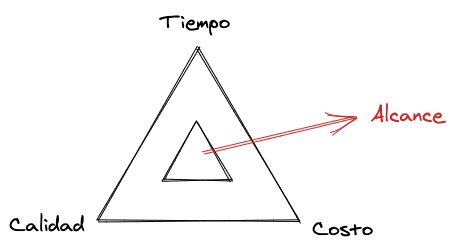
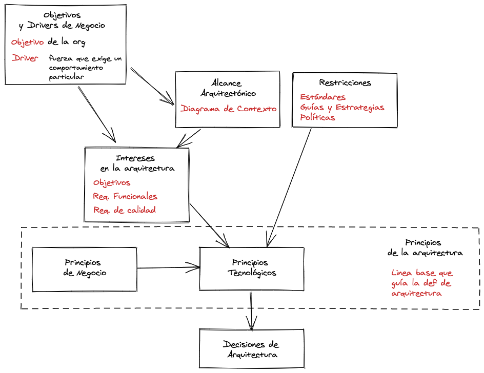

# Introducción

Hoy en día el software es más complejo que nunca debido a diversos factores. Algunos de estos factores son la variabilidad de dispositivos, la disponibilidad de acceso al software, la capacidad de escalabilidad que tenga el software, suinteroperabilidad, y la evolución.

Los clientes y proveedores desean llevar la ejecución de los proyectos de software con presupuestos y tiempos de liberación ajustados, manteniendo una alta expectativa en calidad.

Para equilibrar estas tres dimensiones es necesario que se defina correctamente el alcance del proyecto.

Para no fallar en el manejo de la complejidad del software se utiliza la Ingenería de Software.

La **Ingenería de Software** es la _disciplina que busca aplicar conocimientos, metodos y experiencias de caracter científico, industrial y tecnológico, de manera sistemática, disciplinada y cuantificable a la construcción de software_ .

Los procesos de desarrollo consiste en dos subprocesos simultaneos y interrelacionados. El proceso de **Gestión**, que asegura que e proyecto se ejecute según sus restricciones de presupuesto, recursos y tiempo; y el proceso de **Construcción** que es responsable de la construcción del sistema y de las deciciones técnicas en función de los requerimientos funcionaes y de calidad dentro del contexto de las restricciones del proyecto.

Las decisiones de constucción sobre estructura y comportamiento, integración y plataforma e infraestructura afectan la ecuación tiempo-calidad-costo. Para manejar está complejidad la Ingenería de Software nos entrega como herramienta la Arquitectura de Software.

La Arquitectura de Software es constante durante todo el proceso de desarrollo y entrelaza a las otras disciplinas/actividades del proceso. Nos permite manejar la complejidad, gestionar y controlar los riesgos, reusar el esfuerzo precio efectiva y eficientemente. y realizar evaluaciones tempranas de la calidad.

Además la Arquitectura provee: Control intelectual, Integridad Conceptual, Comunicación Efectiva, Gestión de Variantes y una base para el reuso de conocimiento, experiencia y diseño e implementación.

La Arquitectura de Software entrega:

- Una visión clara y compartida, y una hoja de ruta para el equipo
- Liderazgo técnico y mejor coordinación
- Un estímulo para discutir las decisiones importantes, los requisitos de calidad y las limitaciones
- Un marco para identiicar y mitigar el riesgo
- Coherencia de los enfoques y las normas utilizadas
- Un conjunto de fundamentos firmes para el sistema que se está construyendo
- Una estructura con la que comunicar la solución a diferentes niveles de abstracción para diferentes audiencias

# Definiciones

No existe un consenso en una definición de arquitectura. Sin embargo si se sabe que existen tres afirmaciones fundamentales:

- Todo Sistema de Software tiene una arquitectura de Software
- Todo proyecto de desarrollo de software tiene al menos un arquitecto de software
- El Diseño arquitectónico no es una fase del desarrollo de software. Es una actividad entrelazada

La arquitectura tiene algunos aspectos claves:

- Visión: Entrega una visión compartida del sistema, base de conocimiento, y hoja de ruta para el equipo.
- Decisiones Criticas: Se refiere a las decisiones importantes del sistema que afectan la calidad del sistema, y la descomposición de alto nivel del sistema.
- Puntos de Vista: Debé tener distintos puntos de vista dependiendo de las decisiónes críticas de diferente naturaleza. Hay que aplicar separación de intereses.
- Estructura (estática y dinámica): La estructura estática define los elementos de tiempo de diseño y como se relacionan entre ellos en el sistema. La estructura dinámica explica los elementos en tiempo de ejecución, definiendo la interacción entre los elementos.

Tambíen la arquitectura se refiere a las propiedades visibles externamente, es decir el comportamiendo externo del software (lo que hace el sistema, su flujo de información, respuesta estímulos, y el contrato que expone), y los atributos de calidad (lo que el sistema debe hacer, varian en función de los intereses de los stakeholders).

## Categorías de Arquitectura

### Arquitectura de Aplicación

La arquitectura de aplicación se preocupa de la descomposición de una aplicación en componentes. Aplica patrones de diseño, frameworks y se refiere a un único stack tecnológico. Es el diseño de más bajo nivel.

### Arquitectura de Sistemas

Es la estructura de alto nivel de un sistema completo. Abarca múltiples aplicaciones, por ende tiene varios niveles y tecnologías. Además se refiere a la integración e interoperabilidad con otros sistemas en el entorno.

### Arquitectura de Software

La arquitectua de software es la combinación de la de sistemas y de aplicación. Se refiere a los elementos significativos, estructura y los fundamentos. Consdera la construcción del software y su puesta en producción. Intenta responder a los atributos de calidad.

### Arquitectura Empresarial

Se refiere a la organización, personas, procesos y tecnología de una empresa para que funcione efectiva y eficientemente. Considera la estructura organizacional, los procesos de negocio y la tecnología que los asiste.

## El arquitecto de Software

El arquitecto de software es el responsable de diseñar, documentar y dirigir la construcción de un sistema que satisfaga las necesidades de todos los stakeholders.

Dentro de sus tareas y responsabilidades se encuentran:

- Asegurarse de que el alcance, el contexto y las limitaciones estén documentadas y aceptadas
- Identificar e involucrar a los stakeholders
- Comprender y capturar la preocupaciones e intereses de los stakeholders
- Facilitar la toma de decisiones a nivel de sistema
- Capturar e interpretar lo aportado por especialistas técnicos y de dominio
- Definir y documentar la estructura del sistema
- Definir y documentar las estrategias, estándares y guías a seguir en el desarrollo
- Asegurar que la arquitectura cumpla con los atributos de calidad
- Asegurar que los principios se apliquen al sistema construido
- Tomar un papel de liderazgo en la relaización de un producto o sistema a partir de la arquitectura

Sus habilidades deben ser:

- Comprensión general de la tecnología a un alto nivel
- Comprensión de los problemas del mundo real que el sistema debe resolver
- Experiencia real en el diseño y construcción de sistemas
- Crear consenso
- Facilitar el cambio
- Aprender rápidamente sobre áreas de negocio y tecnologías desconocidas
- Ganar y mantener la confianza de los stakeholders

## Los Stakeholders

Los stakeholders en una arquitectura de software son las personas grupos o entidades que tienen un interes o preocupación por la realización de la arquitectura. El interes o preocupación por una arquitectura es un requisito, un objetivo, una intención o una aspiración que el stakeholder tiene por esa arquitectura.

Las responsabilidades del stakeholder son:

- Asegurarse de que todos sus intereses (concerns) se comuniquen claramente al arquitecto
- Si son representantes, transmitir claramente al arquitecto los intereses de aquellos que representan
- Tomar decisiones de manera oportuna y autorizada
- Si no tienen autoridad, escalar las decisiones a quienes tienen el poder para tomarlas
- Revisar la arquitectura para asegurarse de que el sistema satisface sus intereses y la funcionalidad esperada

Una de las tareas más importantes del desarrollo de software es la identificación y selección correcta de los stakeholders. Un stakeholder debe estar/ser :

- Informado: tiene información, experiencia y comprensión necesaria para tomar decisiones
- Autorizado: sus decisiones no serán revertidas más adelante
- Comprometido: está dispuesto y disponible para participar y tomar decisiones
- Representativo: es un representante adecuado de su grupo

Ejemplos de Stakeholders:

- Adquirentes
- Asesores
- Comunicadores
- Desarrolladores
- Mantenedores
- Proveedores
- Soporte
- Administradores de sistemas
- Testers
- Usuarios

## Definición de Alcance

### Objetivos y Drivers de Negocio

Es lo que mueve a los stakeholders. El porque del sistema. Un **objetivo** es lo que quiere la organización y el **driver** es lo que empuja a la organización a hacer cierta cosa.

### Alcance Arquitectónico

El contexto del problema. Involucra las principales áreas funcionales, las interfaces externas y los sistemas externos, los sistemas que deberán eliminarse o modificarse, y los datos que deberán ser migrados al nuevo sistema.

Checklist:

- Breve, una o dos páginas
- Nivel de detalle apropiado es claro y sin ambigüedad
- Evita el uso de tecnicismos
- Es adoptado y ratificado por
  stakeholders
- Es comunicado y comprendido

### Intereses en la arquitectura

Los concerns obtenidos desde los stakeholders. Pueden ser vagos y poco precisos como especificos y medibles. Pueden ser: **_Objetivos de la arquitectura_** (intenciones y aspiraciones), _**Requisitos funcionales**_, y _**Requisitos de calidad**_. Deben ser trazables, cuantificables, mesurables y testeables.

### Restricciones

Las restricciones para el desarrollo de la solución. Se basa en _**Estándares**_ (abiertos, vendors, de facto, organizacionales),
_**Guías y estrategias**_(recomendaciones de seguridad de la información, estrategia de TI), y
_**Políticas**_ (procesos o procedimientos de la organización que deben seguirse)

### Principios Arquitectónicos

Reflejan las intenciones de como quiero que las cosas sean. Genera los lineamientos generales de las decisiones que se tomaran en la arquitectura.
Pueden ser de negocio y tecnológicos.

Checklist:

- Constructivo
- Razonado
- Bien articulado
- Testeable
- Significativo

## Descripción de la Arquitectura

La descripción de la arquitectura busca expresar la arquitectura hacia sus interesados, para que puedan entenderla y ver sus preocupaciones respondidas.
Una descripción de arquitectura debe presentar tanto la escencia como el detalle de la arquitectura. Cada zoom a un elemento de la arquitectura debe ser en fin de validar los intereses de los stakeholders. Si no existen stakeholders que puedan entender la descripción es mejor no tener una descripción.

El arquitecto construye la arquitectura y es uno de sus principales usuarios, utilizandola como base para sus decisiones. Pero todo stakeholders debería entender la parte dirigida a ellos.

### Contenido de una descripción

- Portada con fecha, status, organización, historial de cambios, un resumen, alcance, contexto, glosario y referencias
- Los stakeholders y sus intereses que sean relevantes
- La especificación de los viewpoints que fueron seleccionados y el rationale
- Una o más vistas (views) de arquitectura que respeten los viewpoints que las gobiernan
- Análisis de la consistencia y un registro de las inconsistencias
- Justificación de los conceptos seleccionados, la evidencia de haber considerado alternativas y la justificación de las elecciones realizadas

### Views

Una vista (view) es una representación de uno o más aspectos estructurales de una arquitectura que ilustra cómo aborda uno o más intereses de lo stakeholders. Incluye solamente los detalles que permiten explicar la arquitectura a los stakeholders o demostrar que sus intereses están resueltos

Para decidir qué incluir en una vista se debe tomar en cuenta:

- A que stakeholder está dirigida
- Los conocimientos técnicos de los stakeholders
- Que interes se busca abordar, y que tanto conocen los takeholders sobre el contexto y los antecedentes de esos intereses
- Cuanto necesitan saber los stakeholders sobre el aspecto de la arquitectura en consideración

Las vistas seorganizan en terminos de uno o más modelos. Cada modelo captura el impacto de las decisiones arquitectonicas, actuando como contenedor para la aplicación de los patrones y expresando la estructura y comportamiendo fundamental dentro de las vitas.

### Viewpoints

Los viewpoints son una colección de patrones, plantillas y convenciones para construir un tipo de vistas. Identifica los stakeholders a los que está dirigido y cuyos intereses están reflejados, Proveen guías, principios y plantillas de modelos para construir vistas, y capturan conocimiento reusable para generar parte de la descripción de la arquitectura.

### Difucultades del uso de views y viewpoints

- Inconsistencia: Tener múltiples vistas trae problemas de consistencia. (Hay lenguajes y herramientas que ayudan a validar aspectos de consistencia)
- Seleccion: No es simple elegir el conjunto de vistas apropiado para un sistema (Depende fuertemente de la experiencia del arquitecto)
- Fragmentación: Utilizar demasiadas vistas hace que la descripción sea difícil de comprender. (Pueden usarse vistas híbridas que combinen modelos de varios viewpoints)

## Frameworks Arquitectonicos

Estructura prefabricada que se utiliza para organizar la descripción de una arquitectura en términos de vistas complementarias. Identifica un conjunto de stakeholders, de intereses y de viewpoints. Provee una base consistente para las descripciones de arquitecturas.

### 4+1 View Model

Considera 4 vistas y una central.

- Logica: Dirigida al usuario final. Aborda los requerimientos funcionales en términos de los servicios ofrecidos. Describe los componentes del sistema y su interacción.
- Desarrollo: Dirigida al programador. Aborda la organización en módulos y capas, el reuso y las herramientas. Habla de la administración de software
- Proceso: Dirigida a los integradores. Aborda requerimientos de calidad como concurrencia, performance, y escalabilidad. Describe los procesos del isstema y como se comunican entre si.
- Fisica: Para los ingenieros de sistema. Muestra la topologúa, entrega, instalación y telecomunicación.
- Casos de Uso: Dirigida a todos los stakeholders, aborzan la consistencia y validez del sistema. Describe los requerimientos funcionales del sistema.

### Views & Beyond

- Modulo:Describe cómo se estructuran las unidades de código del sistema (módulos). Un módulo tiene un conjunto de responsabilidades, propiedades externas e interfaces
- Componente y conector: Describe la estructura de tiempo de ejecución del sistema y cómo estos elementos interactúan. Componentes y conectores se refinen recursivamente
- Alocación:Describe cómo se relaciona el sistema con su entorno. Describe cómo se instalan los módulos en los nodos. Describe cómo los componentes corren en los nodos

### Viewpoints & Perspectives

#### Viewpoints

- Funcional: Describe los elementos funcionales, sus responsabilidades, interfaces e interacciones (en 4+1 es la vista logica)
- De Información: Describe el almacenamiento, manipulación, gestión y distribución de la información (no está en 4+1)
- De Concurrencia: Describe las unidades de concurrencia y su mapeo a elementos funcionales (en 4+1 es de proceso)
- Desarrollo: Describe el soporte al proceso de desarrollo (implementación, testing, evolución)
- Deployment: Describe el entorno en el que se implanta el sistema y las dependencias con ese entorno (Física en 4+1)
- Operacional: Describe cómo se opera, administra y da soporte en el ambiente de producción

#### Perspectivas de Arquitectura

Colección de actividades, tácticas y guías que se utilizan para asegurar que un sistema exhibe un conjunto relacionado de propiedades de calidad que requieren considerar un conjunto de vistas.
Hay perspectivas en Seguridad, Performance y escalabilidad, Disponibilidad y resilencia y Evolución

### C4 Model

#### Abstracciones

- Person: Representa a un usuario humano del sistema de software (actores, roles, personas, etc.)

- Software System: Es el nivel de abstracción más alto. Representa a algo que entrega valor a sus usuarios, ya sea humano o no. Incluye al sistema de software que se está diseñando, y otros de los que depende (o viceversa)

- Container: Representa a una aplicación o repositorio de datos. Es algo que necesita estar en ejecución para que el sistema de software funcione

- Component: Una agrupación de funcionalidad encapsulada que ofrece una interfaz bien definida (ej. colección de clases detrás de una interfaz). La forma en que los componentes son empaquetados es ortogonal (jar, dll, etc.)

#### Views

- System Landscape: Punto de partida para la descripción de la arquitectura. Dirigido a stakeholders técnicos y no-técnicos. Describe qué tipo de sistema es, quién lo usa y cómo se relaciona con el entorno. Hace explícito el contexto
  Muestra qué se está agregando al entorno .Descripción de alto nivel útil para la discusión entre técnicos y no-técnicos. Permite identificar a quién más consultar para entender las interfaces entre sistemas

- Container Viewpoint:
- Component Viewpoint:
- Code Viewpoint:
- Dynamic Viewpoint:
- Deployment Viewpoint:

## Diseño de Arquitectura

El diseño arquitectónico refiere a:

- Descubrir los intereses críticos sde los stakeholders más relevantes.
- Evaluar alternativas de diseño.
- Hacer concesiones (tradeoffs). Revisar Tradeoff por ejemplo entre atributos de calidad. A los stakeholders hay que contraponerles opciones de requisitos.

### Principios del Diseño de la Arquitectura

* Estar dirigido y balancear los intereses de los stakeholders
* Promover la comunicación sobre los principios y las decisiones arquitectónicas
* Asegurar que la construcción del software adhiere a los principios y las decisiones
* Ser estructurado
* Ser pragmático y flexible (considerar las restricciones del contexto y adaptarse a las circunstancias del desarrollo)
* Neutral a la tecnología
* Integrable a diferentes ciclos de vida

### Resultados del Diseño de la Arquitectura

* La descripción de la arquitectura
* La gestión del desarrollo y mantenimiento de todos los elementos capturados en la arquitectura
* Clarificación de los requerimientos
* Gestión de las expectativas de los stakeholders
* Identificación y evaluación de opciones de arquitecturas
* Descripción del criterio de aceptación
* Creación de la entrada al diseño y la construcción del sistema

### Metodos de diseño arquitectonico

La estructura general de los metodos es:
1) Analisis de Requerimiento
2) Toma de Decisiones
3) Evaluación Arquitectonica

#### Analisis de Requerimientos

El primer paso es consolidar la información de entrada. Con eso se define el alcance (Objetivos y drivers de negocio, Restricciones, Áreas funcionales, System context/landscape, Stakeholders, Sistemas a modificar/eliminar y datos a migrar, Intereses críticos(critical concerns), Principios de negocio y arquitectónicos).
Finalmente uno debe identificar los requisitos criticos:
* La información de entrada consolidada debe expresarse en términos de requisitos
* En cada iteración deben abordarse los que se consideren más críticos
* Priorizar los requisitos con los stakeholders
* Seleccionar los requisitos críticos (que tengan mayor importancia o urgencia, o que representen mayor riesgo)

Los requisitos se pueden capturar con caso de uso, historias de usuario, y escenarios arquitectonicos. 
Se pueden crear escenarios arquitectonicos. Un escenario arquitectónico es
una descripción concisa de una situación a la que probablemente se enfrente el sistema en su entorno de producción, junto con una definición de la respuesta que se requiere del sistema. Son la entrada del diseño arquitectónico. Proveen un mecanismo de comunicación con stakeholders. Guían el proceso de evaluación de la arquitectura.

Pueden ser funcionales (Sinopsis, Estado de Sistema, Entorno de sistema, Estímulo externo, Respuesta esperada) o de Calidad (Sinopsis, Entorno del Sistema, Cambios en el entorno, Comportamiento esperado)

#### Toma de Decisiones

El primer paso es evaluar el impacto de resolver los requerimientos criticos elegidos.
* Identificar en qué vistas impacta la resolución de los requerimientos críticos
* Revisar decisiones previas y su efecto en la resolución de estos requisitos
* Realizar tradeoffs

Luego se identifican los estilos y patrones arquitectonicos más relevantes para resolver los requerimientos críticos.

Finalmente se debe decidir que refinamiento realizar a la arquitectura y actualizar la descripción.

* Evaluar pros y contras de cada patrón seleccionado
* Decidir cuál o cuáles aplicar
* Actualizar las vistas arquitectónicas para reflejar la decisión
* Capturar la decisión en la descripción de la arquitectura

#### Evaluar la Arquitectura

## Diseño y Descripción

En terminos generales uno suele empezar con una descripción arquitectonica vacia. Luego escojo un framework para incluir en la descripción con vistas. A medida que se va iterando el diseño las vistas se van poblando de elementos hasta llegar a su versión final.

## Orientación a Servicios

Servicios = Componentes